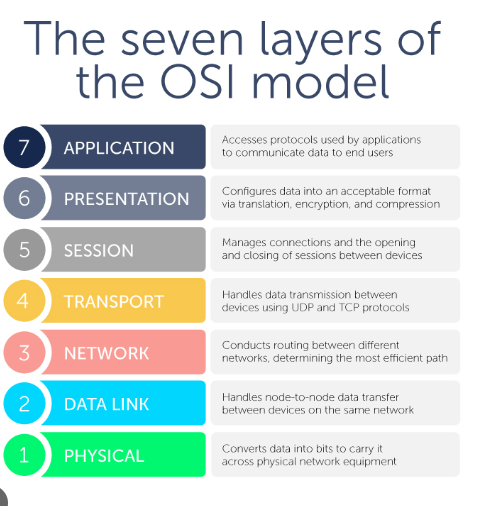
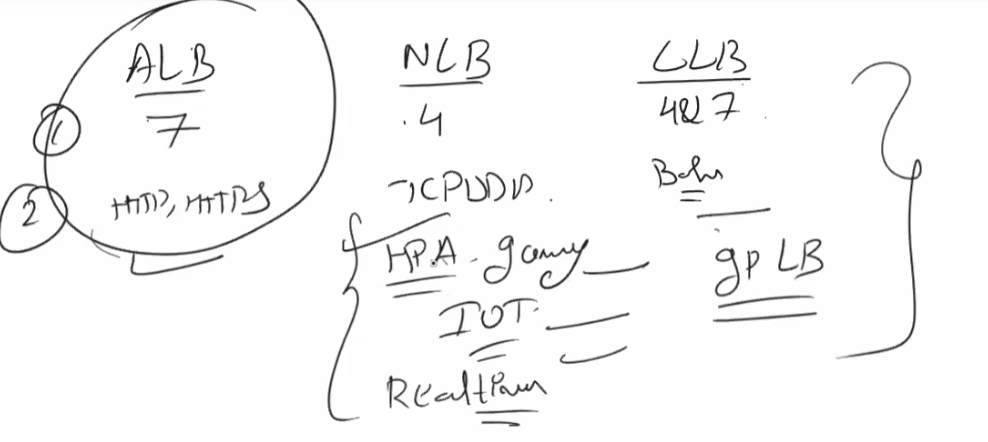

https://aws.amazon.com/about-aws/global-infrastructure/

Day 1:
Cloud Computing
AWS
Why AWS
Solution Archiect C03
Learning Management system
Over View
Regions
Core services 
Account Setup
AWS Console
Billing
Delegation to users and roles

Day 2:

IAM (AWS identity and access Management)

Provies Access control to aws resources. That is who can access what.

Create a user
A role

PCI (Payment Card Industry)

STS

CLI
Compute
Benefits
EC2 Storage
Instace Types
AMI: Amazon machine image 
Information about EC2 instance that we are going to launch

OS
Software
Instance
EBS

Placement Group
Metadata

Day 3

EC2 purchasing options
Hibernation
EBS & Encryption
Elastic Load Balancer
Autoscaling

