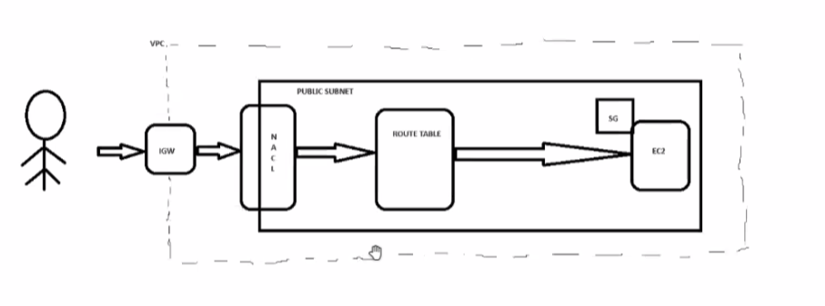
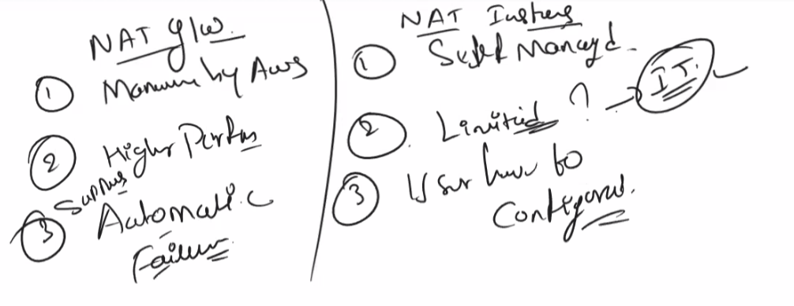
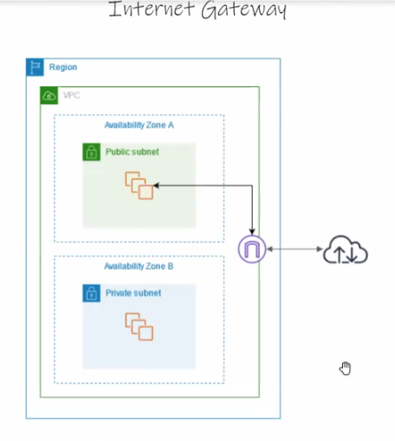
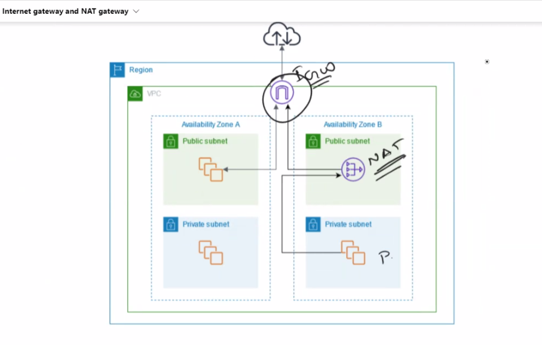
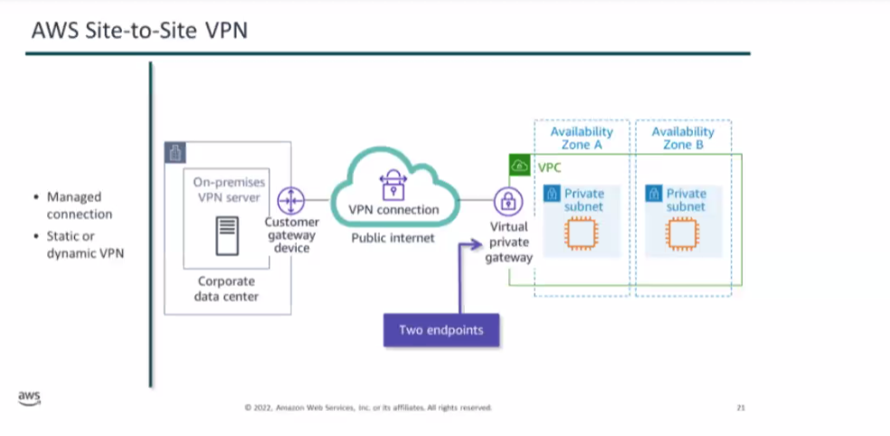
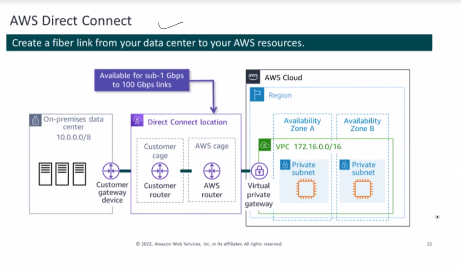
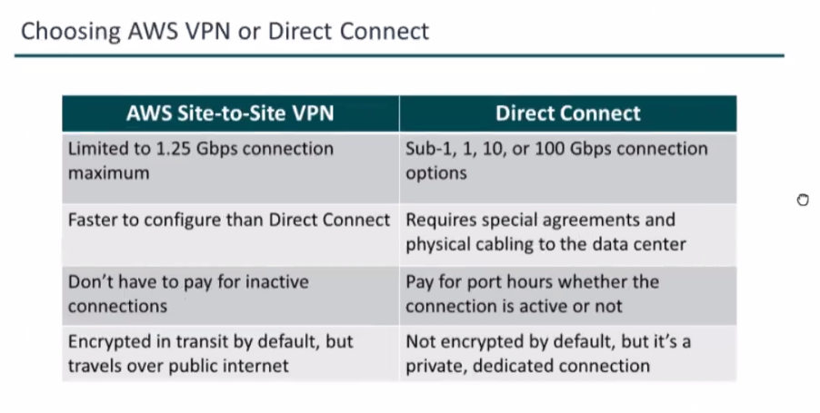

https://aws.amazon.com/about-aws/global-infrastructure/

Day 1:
Cloud Computing
AWS
Why AWS
Solution Archiect C03
Learning Management system
Over View
Regions
Core services 
Account Setup
AWS Console
Billing
Delegation to users and roles
AWS Organization

Day 2:

IAM (AWS identity and access Management)

Provies Access control to aws resources. That is who can access what.

Create a user
A role

PCI (Payment Card Industry)

STS

CLI
Compute
Benefits
EC2 Storage
Instace Types
AMI: Amazon machine image 
Information about EC2 instance that we are going to launch

OS
Software
Instance
EBS

Placement Group
Metadata

Day 3

EC2 purchasing options
Hibernation
EBS & Encryption
Elastic Load Balancer
Autoscaling

Crating a S3 bucket and uploading a file using cloudshell

[cloudshell-user@ip-10-134-45-239 ~]$ aws --version
aws-cli/2.18.4 Python/3.12.6 Linux/6.1.109-118.189.amzn2023.x86_64 exec-env/CloudShell exe/x86_64.amzn.2023
[cloudshell-user@ip-10-134-45-239 ~]$ aws s3 mb s3://mybuckt-anilkuamarsathi
make_bucket: mybuckt-anilkuamarsathi
[cloudshell-user@ip-10-134-45-239 ~]$ aws s3 ls
2024-10-17 12:45:27 mybuckt-anilkuamarsathi
[cloudshell-user@ip-10-134-45-239 ~]$ echo "My New File" >> file.txt
[cloudshell-user@ip-10-134-45-239 ~]$ ls
file.txt
[cloudshell-user@ip-10-134-45-239 ~]$ cat file.txt
My New File
[cloudshell-user@ip-10-134-45-239 ~]$ aws s3 cp file.txt s3://mybuckt-anilkumarsathi
[cloudshell-user@ip-10-134-45-239 ~]$ aws s3 cp file.txt s3://mybuckt-anilkuamarsathi
upload: ./file.txt to s3://mybuckt-anilkuamarsathi/file.txt       
[cloudshell-user@ip-10-134-45-239 ~]$ aws s3 ls s3://mybuckt-anilkuamarsathi
2024-10-17 12:49:34         12 file.txt

Day 4:

Auto Scaling and its types

    Scheudule Scaling (During peek season)
    Dynamic Scaling ()
    Predictive Scaling (Using Histrorical Data)

Storage
Intro S3
Components of S3
S3 storage classes
Versioning
Cross Region Replication

Day 5

S3 Life Cycle management
S3 Encryption
Access control
Storage gateway
Server Side Encryption
S3 and KMS
FSX
Athena and Glue

Networking Basics
Firewall
NACL
Security Groups
Internet gateway
Route Table

S3 Life Cycle Management

Tranistion Action : Action deals with moving object from one storage class to another at a specific time.
Expigration Action : Deletion of the object after a certial period.

this is an xml file

Access control List: Basic r/w permissions

FSX will launch, runs and scale
is used for Windows and lusture

Grew:Serverless data integration service (Data Integration, Automation)
Atena: Serverless Architecture

VPC is an isoloated space to deploy your application

in a region 5 VPCs can be created

Every Region there will be 1 default VPC

Subnet is a range of IP address

All the incoming traffic is blocked and outgoing traffic is allowed

NCAL Is a virtual firewall at subnet level

NACL all incoming and outgoing traffic is allowed

Route table determines where your traffic will be routed

Day6

IP Addresses
VPC flow logs
VPC endpoints
IGW & NAT
VPC peering
Transit GW
VPN Connection
CloudFront
Lambda & Edge
Global Accelator

IPAddress: IPV4(32 bit) and IPV6(128 bit)
Private IP Addresses: Unreachable over the internet. Used to comminicate between instance within VPC.
Public IP Addresses: reachable over the internet. Userd to do a communication between intsance and internet.
Elastic IP Addresses: Is a consistent IP address that associated or deassociated and are chargable

VPC Flow logs
Feature of VPC Captures the information about the Traffic going to and from the network within the VPC
The logs can be store in S3 or Cloud Watch logs

Source, Destination 

NAT( Network Address Translation)
Natting is a process which converts private IP to public IP

NAT allows the private subnet connection to internet.

NAT Gateway (Highly avilable manaaged service by AWS and can handle upto 45GBps of bandwidth and inherantly redundant
55000 concurent connections to each destination). Limitations: Single Elastic IP can be assigned
NAT Instance: 

VPC endpoint will allow to connect to AWS resorces without connecting to internet.
Benefit: 

a) Interface endpoint: uses AWS private link to connect AWS to other AWS Services. chargable
b) Gateway endpoint: S3 and Dynamo DB

VPC peering

Secure link between 2 VPCs

Transitive pairing is possible
IP addresses should not overlap

To connect multiple VPCs. Transit Gateway is the solution. Can connect upto 5000 VPCs, Used for applicaiton that are accesible around the world

VPC peering usage: Inter Organization collaboration

System Manager

Insight
Group Policy
Actions
Autmation 

VPN(Virtual Private Network) connections
On Premise network to the remote offices or a client device or any other AWS network.

Types of VPN
1) Site to Site VPN
2) Client VPN
3) VPN Cloud HUB
4) Third Party s/w VPN appliances 

Windows has Open VPN Client
MAC Tunnel 
linux Open VPN Package

Third Party (It provide more flexiblity for software selection)
Cisco Any Connect
OKTA 
Global Protect

Protocol that we use in VPN Connection is IPSEC Protocol

