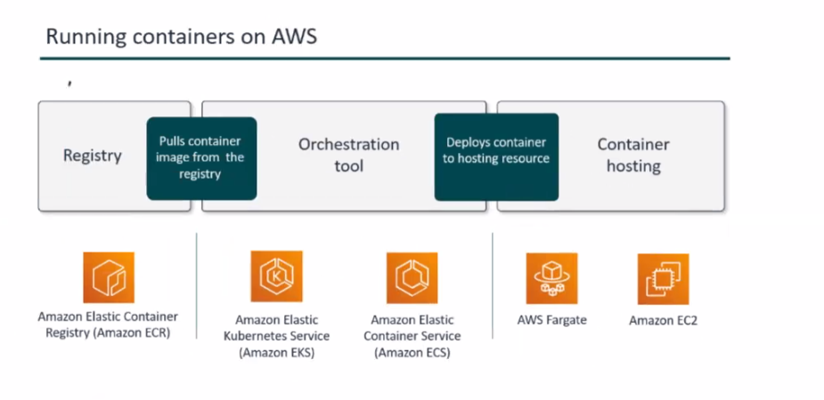

https://aws.amazon.com/about-aws/global-infrastructure/

Day 1:
Cloud Computing
AWS
Why AWS
Solution Archiect C03
Learning Management system
Over View
Regions
Core services 
Account Setup
AWS Console
BillingVP
Delegation to users and roles
AWS Organization

Light sail is the preconfigured EC2 computer service unlike regular EC2 which needs some amount of work that is needed to install the required 
software applications. Bundled into one simple price.

AWS Batch enabled devlopers to run thousands of compute services.

Elastic Bean stack is a service that is used to deploy web applications developed with Java, .Net, PHP, Python, Ruby or docker on servers 
such as Apache, IIS or NGNIX

Fargate is another option to run containers. ECS (run containers in EC2 and in Fargate).All that we need to specifiy is the cpu and memory that 
we need and AWS will create a continer for us.

Lambda is a service created to run the code without the server. Source code which is in functions. We only pay for the time which it is running

SAR(Serverless Application Repository) is a AWS template application repository to deploy code.

Day 2:

IAM (AWS identity and access Management)

Provies Access control to aws resources. That is who can access what.

Create a user
A role

PCI (Payment Card Industry)

STS

CLI
Compute
Benefits
EC2 Storage
Instace Types
AMI: Amazon machine image 
Information about EC2 instance that we are going to launch

OS
Software
Instance
EBS

Placement Group
Metadata

Day 3

EC2 purchasing options
Hibernation
EBS & Encryption
Elastic Load Balancer
Autoscaling

Crating a S3 bucket and uploading a file using cloudshell

[cloudshell-user@ip-10-134-45-239 ~]$ aws --version
aws-cli/2.18.4 Python/3.12.6 Linux/6.1.109-118.189.amzn2023.x86_64 exec-env/CloudShell exe/x86_64.amzn.2023
[cloudshell-user@ip-10-134-45-239 ~]$ aws s3 mb s3://mybuckt-anilkuamarsathi
make_bucket: mybuckt-anilkuamarsathi
[cloudshell-user@ip-10-134-45-239 ~]$ aws s3 ls
2024-10-17 12:45:27 mybuckt-anilkuamarsathi
[cloudshell-user@ip-10-134-45-239 ~]$ echo "My New File" >> file.txt
[cloudshell-user@ip-10-134-45-239 ~]$ ls
file.txt
[cloudshell-user@ip-10-134-45-239 ~]$ cat file.txt
My New File
[cloudshell-user@ip-10-134-45-239 ~]$ aws s3 cp file.txt s3://mybuckt-anilkumarsathi
[cloudshell-user@ip-10-134-45-239 ~]$ aws s3 cp file.txt s3://mybuckt-anilkuamarsathi
upload: ./file.txt to s3://mybuckt-anilkuamarsathi/file.txt       
[cloudshell-user@ip-10-134-45-239 ~]$ aws s3 ls s3://mybuckt-anilkuamarsathi
2024-10-17 12:49:34         12 file.txt

Day 4:

Auto Scaling and its types

    Scheudule Scaling (During peek season)
    Dynamic Scaling ()
    Predictive Scaling (Using Histrorical Data)

Storage
Intro S3
Components of S3
S3 storage classes
Versioning
Cross Region Replication

Day 5

S3 Life Cycle management
S3 Encryption
Access control
Storage gateway
Server Side Encryption
S3 and KMS
FSX
Athena and Glue

Networking Basics
Firewall
NACL ( Is Stateless)
Security Groups
Internet gateway
Route Table

S3 Life Cycle Management

Tranistion Action : Action deals with moving object from one storage class to another at a specific time.
Expigration Action : Deletion of the object after a certial period.

this is an xml file

Access control List: Basic r/w permissions

FSX will launch, runs and scale
is used for Windows and lusture

Grew:Serverless data integration service (Data Integration, Automation)
Atena: Serverless Architecture

VPC is an isoloated space to deploy your application

in a region 5 VPCs can be created

Every Region there will be 1 default VPC

Subnet is a range of IP address

All the incoming traffic is blocked and outgoing traffic is allowed

NCAL Is a virtual firewall at subnet level

NACL all incoming and outgoing traffic is allowed

Route table determines where your traffic will be routed

Day6

IP Addresses
VPC flow logs
VPC endpoints
IGW & NAT
VPC peering
Transit GW
VPN Connection
CloudFront
Lambda & Edge
Global Accelator

IPAddress: IPV4(32 bit) and IPV6(128 bit)
Private IP Addresses: Unreachable over the internet. Used to comminicate between instance within VPC.
Public IP Addresses: reachable over the internet. Userd to do a communication between intsance and internet.
Elastic IP Addresses: Is a consistent IP address that associated or deassociated and are chargable

VPC Flow logs
Feature of VPC Captures the information about the Traffic going to and from the network within the VPC
The logs can be store in S3 or Cloud Watch logs

Source, Destination 

NAT( Network Address Translation)
Natting is a process which converts private IP to public IP

NAT allows the private subnet connection to internet.

NAT Gateway (Highly avilable manaaged service by AWS and can handle upto 45GBps of bandwidth and inherantly redundant
55000 concurent connections to each destination). Limitations: Single Elastic IP can be assigned
NAT Instance: 

VPC endpoint will allow to connect to AWS resorces without connecting to internet.
Benefit: 

a) Interface endpoint: uses AWS private link to connect AWS to other AWS Services. chargable
b) Gateway endpoint: S3 and Dynamo DB

VPC peering

Secure link between 2 VPCs

Transitive pairing is possible
IP addresses should not overlap

To connect multiple VPCs. Transit Gateway is the solution. Can connect upto 5000 VPCs, Used for applicaiton that are accesible around the world

VPC peering usage: Inter Organization collaboration

System Manager

Insight
Group Policy
Actions
Autmation 

VPN(Virtual Private Network) connections
On Premise network to the remote offices or a client device or any other AWS network.

Types of VPN
1) Site to Site VPN
2) Client VPN
3) VPN Cloud HUB
4) Third Party s/w VPN appliances 

Windows has Open VPN Client
MAC Tunnel 
linux Open VPN Package

Third Party (It provide more flexiblity for software selection)
Cisco Any Connect
OKTA 
Global Protect

Protocol that we use in VPN Connection is IPSEC Protocol

DAY 7:

1)CloudFront
2)Lambda and Edge
3)Gbal Accelrator
4)Route53 and policies
5)Database (Types and DB and RDS)

CloudFront is a global content delivery network service which is designed to Securely and efficiently sistribute content to end user 
ensuring low latency and high transfer.

The accelration is achieved by caching the content.

Steps for CloudFront
1) Define Origin Server
2) upload data
3) Create CloudFront Distribution

OAI( Origin Access identity )
Helps securely server private content 

Global Accelrator
Is specially designed to enhance application performance

https://speedtest.globalaccelerator.aws

NVirgina 11% faster
Oregon  33% faster
Ireland 34% faster
Frankfurt 72% faster
Zurih 35% faster
Tokyo 82% faster
Singapore 32% faster

Features of Route53
1) Resolver
2) Traffic flow: It route the end user to the best route
3) Latency Based routing : Route the user to the route that has low latency
4) GEO DNS :  Route the user based on Geopgrahic location
5) Health Checks and monitoring: Monitors health and latency
6) Domain Registration: godaddy is popular domain registration company

Hosted Zone: Collection of DNS records
1) Public Hosted Zones ( Route the traffic over internet)
2) Private Hosted Zones (Route the traffic over  VPC )

DNS records defines how the traffic is routed

Route53 policies

Shrink: Reduction in volume size

Databases

Day 8

1) RDS
2) RDS replica
3) Multi AZ deployment
4) Aurora
5) Dynamo DB
6) Global tables
7) Case study 
8) In memory database
9) Redshift

RDS: Relational Database Service : It simplifies the process of setting up, operating and also scaling in AWS cloud.
RDS is fully managed service (Backup, Software Patching, Hardware provisioning is handled).
Scalability is easy and can be used to manage the growing demands of the application.

Data is encrypted at REST and In transit

Integrated with IAM

Pay as you go model for pricing

MySQL, POST GRES, oracle, maria db etc

DBInstance is a fundamental building block of RDS. Standalone database that runs on AWS cloud

DB Instance is a core component of the database.

1) Standalone environment. Provides isolation
2) Multi database capacity: using RDS we can manage multiple database
3) can use RDS using console, SDK

RDS classes
1) General Purpose: Best fit for small and medium scale
2) Memory Optimized: High memory intensive application (ETL, Analytics, Caching). High through put tasks
3) Bustable performance: Flexible CPU usage but there will be a burst(short period of time there is huge amount of traffic).

Upto 40 DB instances can be created per region per account.

Backups

1) Automated Backups: Backup every 30 mins, the backups are available for 35 days
2) Point in time: Backup during a specific time
3) Database Snapshot: Are user initated backups
4) Snapshot copies: 
5) Snapshot sharing:

Multi AZ deployment: Replicates syncronously replicates to a standup instance available in different AZ.

Read replica is used for enhanced perforance and increased availability and designed for security durability of RDS 

1) enhanced perforance 
2) increased availability 
3) designed for security

Amazon Aurora

Amazon version of database with Speed + availablity

upto 5 times faster than a standard mysql database
upto 3 times faster than a postGresSQL database

Aurora maintains 6 copies of data

Aurora Serverless

Types 
V1 -- Simple and cost effective option
V2 -- Built on the foundation of V1 offer more advanced features. Scalability and seamless for demanding workload. Instant scalability is not available. Samsung and panasonic are customers of aurora

Multimaster

DynamoDB
More popular no sql database
Fully Managed no sql database service that provides fast and predictable service
Offers Encryption at Rest
Offers fast and predictable performance
Scalability without effort
Enterprise readiness
Consistent single digit millisecond response time

Read Consisteny in Dynamo DB
    1) Eventually Consistent Reads
    2) Strongly Consistent Reads

Global Tables
1) Fully Managed
2) Multi Region
3) Multi Master

database that delivers fast

GSI(Global Secondary Index) where there is an option to query in multiple partitions

LSI (Local Secondary Index) where there is an option to query in specific partitions

zoom and Snapchat are the customer of Dynamo DB

https://www.duolingo.com/ 
uses dynamoDB

Day 9

1) Elastic Cache
2) Redshift
3) Security, IAM
4) Shared resonsibility model
5) Federation
6) Delegation
7) IAM principles
8) Pounosis
9) ARN
10) Control Tower
11) Cognito
12) AWS WAF

https://aws.amazon.com/elasticache/redis-vs-memcached/

Redshift popular customers

Lexis nexus
Nasdac
MagilaRX

Day 10

1) AWS Cognito
2) AWS Control Tower
3) AWS WAF
4) Shield
5) Config
6) Secret Manager
7) Trusted Advisor and inspector
8) Guard duty
9) Mauip

AWS Cognito: Authentication, User Management, Security features

User poal
Identity Poal

Can the user pool and identity pool be isolated to a specifc VPC?

WIZ uses AWS Cognito

Control Tower extends the capacity of AWS Organization

Landing Zone: Is a starting point from which we can deploy your application.

AWS web application firewall

Day 11
Serverless
Lambda
API gateway
Simple Queue Service
Simple Notification Service

Day 12
Kinesis & its types
Monitoring and Automation
Cloudwatch Service
Metrics
Alarm and it States
Cloud Formation
Template & Stack
Best practices for Cloud Formation 

Kinesis is designed to handle data in realtime 

[examtopics/exams/amazon](https://www.examtopics.com/exams/amazon/aws-certified-solutions-architect-associate-saa-c03/view/)

