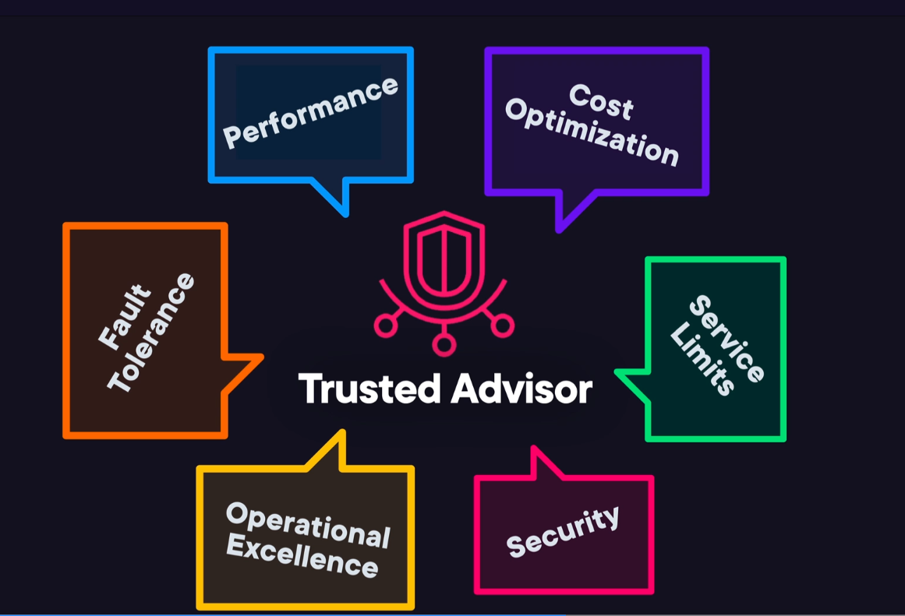
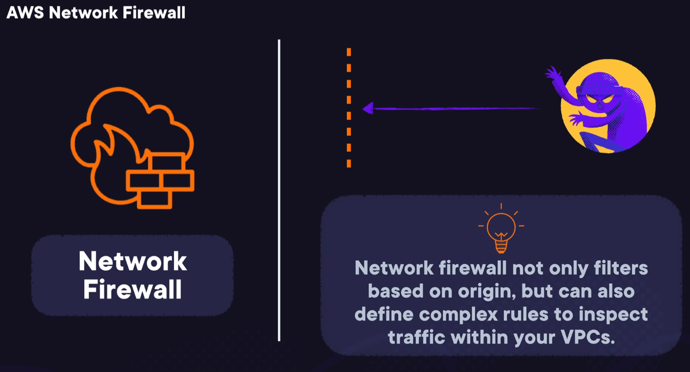
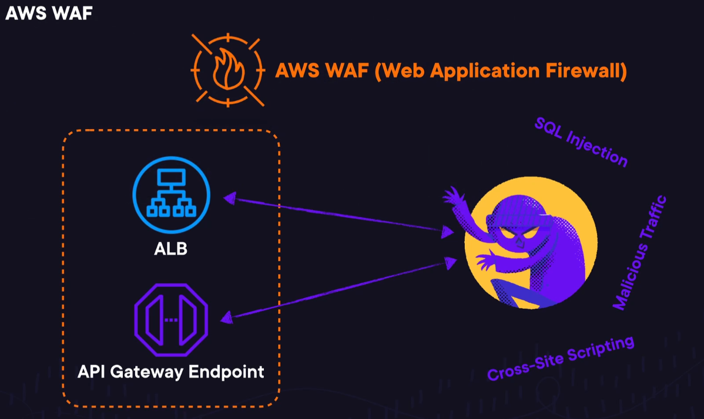

AWS Artifact: You can locate AWS compliance report and access agreements made with AWS.

Reviewing the full history of change made to your application's data is done using Amazon Quantum Legder Database (QLDB) provides cryptographically verifiable transaction log which is fully transparent and immutable.

S3 Glacier was created for a retieval time that is 3-5 hours and for data that is infrequently accessed.

AWS Firewall Manager is a service for security management and enables you to perform configuration and management of firewall rules centrally across accounts and applicaitons in AWS organization. You can also enforce  a set of security rules to keep new resources and applications in complaince. You can also deploy Network firewall using AWS firewall manager. AWS Network Firewall enables securing virtual networks at a large scale. It allows for traffic filtering at the perimeter of a VPC.

Amazon macie is fully managed service providing data security and privacy. It utilizes machine learning and pattern matching for monitoring and protecting sensitive data on AWS system. Macie provides automation for discovering sensitive data in S3 buckets This data can include both PII and financial data.

AWS Resource Access Manager(AWS RAM) This is an AWS Service used for sharing resources securely accross multiple AWS accounts and within organizaitonal units and organizations. AWS RAM enables respire sharing with AWS IAM users and roles for various resource types, allowing you to create a resource once and then use AWS RAM  to share that resource with other accounts.

AWS Trusted Advisor gives you the ability to validate service limits using the performance category. This section shows you the different types of limits and usage information related to the AWS resource you are currently using. For example, if you are using an application programming interface (API) gateway, then you can modify the throttle rate based on your account Region. Here you can increase the throttle rate by ten thousand requests per second. You can also increase Auto Scaling limits and discovery service limits. This resource allows you to increase performance while following best practices within the industry.

AWS Personal Health Dashboard only focuses on the health of AWS resources, such as hardware checks.

The Effects section of an AWS Identity and Access Management (IAM) policy determines the behaviors and actions of what the policy will allow. You have to understand the effects of what occurs when a user might request access by either allowing or denying the request. Because the default option is to deny everything within the first type of requests, you have to grant specific permissions that you might need.

Amazon CloudFront is a great AWS solution that increases the speed at which data is distributed to multiple data centers called edge locations. A user requests dynamic or static content from their closest geographic edge location with the smallest network delays. This process dramatically decreases the time at which customers wait on their data.

AWS Data Exchange allows you to locate and use third-party information that is related to sustainability. This provides you access to data sets which are accessible through the Open Data Sponsorship Program and Amazon Sustainability Data Initiative. AWS works with companies for making Environmental, Social & Governance (ESG), weather, satellite imagery, and air quality data accessible to clients.

AWS Trusted Advisor is a tool that indicates how you should provision your AWS resources as per AWS best practices. It performs real-time monitoring of your AWS resources and recommends actions accordingly.

AWS Outposts allow a company to use AWS services inside of their own data center or company building. Outposts create a miniature Region inside of a data center, providing all AWS services in an isolated private location. This is an example of a hybrid cloud approach.

AWS Storage Gateway provides secure and seamless access for on-premises systems and applications to unlimited storage on AWS.

An Amazon DynamoDB database provides a NoSQL database service that delivers millisecond returns on data to the end user or application. You can fully manage the production within the cloud infrastructure. This database supports key-value and document store models, and is a good fit for web, gaming, mobile, and ad tech systems. It also supports replication across multiple masters and multiple Regions using its global tables option. It has self-managed backups utilizing its native database protection option with on-demand and continuous backup solutions.

Amazon Aurora is a relational database that offers PostgreSQL- and MySQL-compatible database solutions. It is fully managed by Amazon Relational Database Service (RDS). Amazon Aurora is not considered a NoSQL database service.

Amazon Relational Database Service (RDS) is a database cloud solution for applications that require Oracle, PostgreSQL, MariaDB, MySQL, Microsoft SQL Server, or Amazon Aurora. This is not considered a NoSQL database option.

Amazon Redshift is a petabyte-scaled infrastructure that is considered a data warehouse solution. This is not a NoSQL database.

Customer-specific controls are very specific in that the overall controls and responsibilities fall to the customer. They are responsible for support in all manners, which includes the creation, installation, and development of applications that reside on top of an Amazon Elastic Compute Cloud (EC2) infrastructure. Customers are also responsible for patching, configuration, and training, but these are considered shared by both Amazon and customers. Customer-specific controls are network traffic, data identity and integrity, client and server-side data, encryption, and authentication.

Patch Management controls is a shared control, which means that AWS is responsible for patching the underlying AWS platform and the customer is responsible for patching software that resides on top of the AWS EC2 instance.

Configuration Management controls is also a shared control, which means that AWS is responsible for configuration infrastructure devices associated with the network and the customer is responsible for supporting their own operating systems and applications that they use on the AWS platform.

Awareness and Training controls is not a customer-specific control but a shared control. This means that customers are responsible for learning and training their own people and AWS is responsible for the awareness and training of AWS resources.

A Convertible Reserved Instance can be exchanged within the same term and you can easily select new instance attributes such as instance type and platform. You can also change the instance family scope and tenancy. There are no limitations on the number of times you exchange your instance. The only requirement is that the instance type you are changing to has to be of higher or equal value to the original instance.

Spot Instances are primarily viable for batch type processing environments, but are considered an instance that could be interrupted. Therefore, they would not be a good fit for an application that requires 24/7 uptime.

On-Demand Instances are primarily used for temporary areas of increased workloads and processing, and are not available 24/7.

Cost Optimization is a framework pillar that supports the improvement and efficiencies of an AWS infrastructure over its complete lifecycle. The purpose of cost optimization is to meet functional requirements while achieving the smallest price point available. From a design perspective, its principles are overall efficiency, consumption modeling, not spending money on data centers, analyzing expenditures, and using managed services.

Performance Efficiency is a framework pillar that supports computing resources to maintain and meet business requirements as technologies change over time within the AWS infrastructure. The focus is on performance rather than improvement and refinement.

Storage is a sub-component found under the performance efficiency pillar. Storage refers to the different types of storage relating to file, block, and object-level storage. This is not related to the improvement and refinement pillar.

Reliability is focused on the stability of AWS systems and their ability to support business value with long uptimes and durable systems. This pillar is not focused on improvement and refinement but rather the durability and uptime of an AWS resource.

You would use DynamoDB when using a serverless database system and when catering to up to 45 million requests per second. You do not need to install or patch any software for it. Being highly scalable, DynamoDB has a millisecond response time and can handle 45 million requests per second. DynamoDB is a non-relational database, which means that data is stored in tables as key value pairs. You can update the attributes of the items in these tables. Each attribute can be viewed as a feature of the data. Non-relational databases are also called NoSQL databases.

You would not utilize the Amazon DynamoDB database when utilizing SQL for data organization. To utilize SQL for data organization, you need a relational database solution, which can include Amazon’s Relational Database Service (RDS). RDS is a fully managed service where AWS handles all the administrative support related to the database like provisioning hardware, patching, and performing backups. This is in contrast to a situation where you would install databases manually on Amazon Elastic Compute Cloud (EC2) instances which would be time consuming and entail a lot of additional overhead of maintaining the database. RDS offers encryption at rest and in transit for several of its supported database engines. RDS is available for database engines like Amazon Aurora, MySQL, PostgreSQL, MariaDB, Oracle Database, and Microsoft SQL Server.

You would not utilize the Amazon DynamoDB database when creating a scalable data warehousing solution. To create a scalable data warehousing solution, you would need to use Amazon Redshift. It helps perform big data analytics and has the capability to collect data from multiple sources. This way you can analyze trends and relationships within your data. Redshift offers very high performance tailored for business intelligence workloads. Redshift nodes routinely run into petabyte sizes. You can use Redshift Spectrum to run SQL queries on exabytes of data residing in data lakes.

You would not utilize the Amazon DynamoDB database when storing data using Amazon Aurora. To store data using Amazon Aurora, you would not use DynamoDB. Amazon Aurora is a relational database that operates at the enterprise level. It is five times quicker than MySQL and three times quicker than PostgreSQL. Amazon Aurora helps reduce the operating costs of your database by reducing redundant IO operations and ensures the high availability and reliability of the database. Amazon Aurora replicates six copies of data across three Availability Zones (AZs) and backs up data to Amazon S3.

The most effective solutions is to use AWS Organizations and service control policies because you can use an AWS Organization account to manage all of your AWS accounts. You would then create a service control policy that controls the actions and services of users or roles. These policies allow you to easily manage AWS accounts and their different functions as it relates to users’ job roles.

The AWS corporation is not responsible for the management of AWS accounts, so you would not contact AWS to configure your initial AWS Identity and Access Management (IAM) roles and users.

You cannot create a new IAM policy role for users on the east coast and user accounts for the west coast. You need to create AWS user accounts for all users. You would then determine which roles should have specific authorizations and assign those roles to the respective AWS users, regardless of their location.

You should not create one ID for the east coast users and one ID for the west coast users. You should never allow groups of users to share the same account to log in to any type of production or even non-production system.

Terminating unused Elastic IPs is the most sustainable option. Elastic IPs are public static IP addresses that you allocate to your resources. By terminating unused Elastic IPs, you are avoiding unnecessary charges and the associated environmental impact of running those resources.

Scaling up an EC2 instance increases the resource consumption of the instance. While it might be necessary for handling increased load, it's not the most sustainable approach in the context of this question where we're looking to minimize resource usage.

Enabling detailed billing reports might help you identify areas for cost optimization but it does not directly reduce resource usage itself.

Implementing a vulnerability scanning tool for security does not directly address resource usage or environmental impact in the context of the sustainability pillar.

You would use AWS License Manager which is an AWS service that simplifies the management of software licenses from multiple vendors, including IBM, Oracle, SAP, and Microsoft, through a centralized system. It covers both your AWS and on-premises systems. AWS License Manager also lets you change license types between bring your own license (BYOL) and AWS-provided licenses with your licensed media. Using BYOL opportunities can help you save costs on cloud infrastructure.

You would not use Amazon Rekognition. Amazon Rekognition allows you to have video and image analysis capabilities in your applications.

You would not use Amazon Forecast. Amazon Forecast provides accurate, time-series forecasts using ML and statistical algorithms.

You would not use AWS X-Ray. AWS X-Ray provides detailed data on requests that your application serves.

Bootstrapping is the name for a set of common applications that apply service packs, security patches, and security updates, and has the ability to register Amazon Elastic Compute Cloud (EC2) instances to execute security monitoring remotely and to manage other systems. Some bootstrapping applications include Cfn-Init, Cloud-Ini, Capistrano, Chef, and Puppet. When you deploy AWS Cloud Development Kit (CDK) apps into an AWS account and Region (collectively called an environment), you need to provision resources that AWS CDK needs for making deployments. Bootstrapping is the process of provisioning initial resources for deployment which include an Amazon Simple Storage Service (S3) bucket and Identity and Access Management (IAM) roles.

The Trusted Advisor tool checks the compliance on AWS Identity and Access Management (IAM) configurations to make sure they have secure access to respective AWS resources. It also validates ports such as 22, 3389, and 5500, and multiple database ports such as 1433, 3306, and 1521. It is not a tool that installs security updates on an EC2 system.

IAM policies are a way of defining permissions for a user or resource by attaching this component. This component is then evaluated as allowed or denied. This is not a tool used for installing security patches.

Amazon DynamoDB Accelerator (DAX) is an AWS feature that implements an in-memory acceleration component used by DynamoDB application programming interface (API) that creates up to ten times faster response times. This caching feature lets you dynamically scale to the demand of the application workload. This is incorrect because it is not a tool used to install service packs or security patches.

Amazon Relational Database Service (RDS) can scale, operate, and configure several different types of relational databases within the Amazon cloud infrastructure. It allows you to easily provision database selection, hardware setup, backups, and even patching.

Database Migration Service is a product used to easily migrate or replicate data to an Amazon RDS infrastructure. This service does not allow you to create databases.

Amazon DynamoDB is a NoSQL database solution within the Amazon infrastructure that is inexpensive and has unlimited storage capacity. Amazon DynamoDB is a specific relational database and does not allow you to create other database solutions.

Amazon RedShift is an Amazon warehouse solution for managing up to petabytes of data. It increases performance using columnar storage technology by increasing IO blocks across a multi-node solution. This product does not allow you to create other relational database solutions.

AWS usage should be focused on building applications spread across multiple Availability Zones (AZ) and Regions. You can always extend your application by adding load balancers and additional AZs to your preconfigured scaling group, but spreading your application workload across different AZs and even Regions will create a level of increased elasticity with expanding application functionality and data integrity.

You never want to focus on reducing costs when expanding the architecture of your application. The key is to separate your primary functions onto different Amazon Elastic Compute Cloud (EC2) instances and add additional AZs and Regions as needed.

AWS usage focused on Amazon S3 components is too finite of an option from an architectural perspective.

You will use security groups for this. A security group is a virtual firewall that protects an EC2 instance. Security groups allow all outbound traffic and deny all inbound traffic by default. You can customize a security group to specify the kinds of traffic that may be permitted or denied.

You will not use a network access control list (NACL). An NACL is a virtual firewall for controlling incoming and outgoing traffic on a subnet. A subnet is a section of a virtual private cloud (VPC) where resources can be grouped based on their security or functional requirements.

You will not use AWS Web Application Firewall (WAF). A WAF controls incoming requests from a network into your web applications. AWS WAF permits or denies traffic based on a web access control list (ACL). AWS WAF works in conjunction with Amazon CloudFront as well as Application Load Balancer.

You will not use AWS Marketplace. This is a digital library that contains thousands of third-party software from across varying applications and industries. You can view detailed data on each software listing, which includes user reviews, pricing options, and support plans. Some of the categories that AWS Marketplace provides software for include: DevOps, business applications, machine learning (ML), Internet of Things (IoT), security, data products, and infrastructure.

You can create theree customer support cases using AWS support

- Account and billing
- Service limit increase
- Technical support

You cannot create technical support cases if you have a Basic support plan. 

To change your support plan, you do not create a customer support case but access Support plans from the AWS Management Console using your root account.

To close your account, you do not create a customer support case but access the Billing and Cost Management console and navigate to the Close Account section.

You do not change the root account email address by creating a customer support case. To change the root account email address, you need to access the Billing and Cost Management console and navigate to the My Account section.

A Botnets infection is like that of a Trojan horse, worm, or virus that attempts to infect a large set of Amazon Elastic Compute Cloud (EC2) instances, such as a fleet of servers. It could be possible that the Botnet infection is comprised of a small network of servers with malicious undetectable code that could bring down an entire network by infecting multiple servers. It is typical with this type of infection that it is controlled remotely or externally by a user with malicious intent.

Multi-factor authentication (MFA) is a security option for validating a user’s identity on a network, based on substantiating two or more pieces of information, and is not related to attacks.

SPAM is where a system can be under siege by having an attacker distribute large amounts of unsolicited mail throughout your network. Amazon EC2 is set up to limit this feature, but it is still the responsibility of the customer to prevent this security concern.

The Trusted Advisor tool checks the compliance on AWS Identity and Access Management (IAM) configurations to make sure it has secure access to respective AWS resources. Overall, the tool looks for security flaws in configuration components and for performance issues in systems, while also looking for underutilized resources. It has nothing to do with malicious attacks.

You would select Spot Instances for any workloads that can withstand interruptions. These can include batch processing workloads. Spot Instances offer up to 90% discount over On-Demand Instance pricing with the caveat that they can be reclaimed at any time by AWS following a two-minute warning.

Savings Plan model is not the right choice for workloads that are interruptible, but this model is more suited for consistent Amazon Elastic Compute Cloud (EC2) usage. This usage can be committed to by a user for one- to three-year terms, and the usage itself is measured in dollars per hour. The Savings Plan model can help save up to 72% on compute usage costs. This model is not limited by the EC2 instance family, tenancy, region, size, or OS. It can also be applied to AWS Lambda and Fargate usage, which are serverless compute systems.

On-Demand Instances are not suitable for interruptible workloads. On-Demand Instances are suited for workloads that are irregular but not interruptible. They are ideal for testing applications. They do not need upfront payments and can be paid for based on usage. 

Dedicated Hosts are not suitable for irregular workloads and are the most expensive of all instance options. These are actual physical servers that have Amazon EC2 instances and completely dedicated to the customer that has purchased them. This allows customers to utilize their existing per-Virtual Machine (VM), per-socket, or per-core licenses that ensures license compliance. You can purchase On-Demand Dedicated Hosts as well as Dedicated Hosts Reservations.

You would use AWS Data Exchange. This allows you to locate and use third-party information that is related to sustainability. It provides you access to data sets which are accessible through the Open Data Sponsorship Program and Amazon Sustainability Data Initiative. AWS collaborates with companies for making environmental, social, and governance (ESG), weather, satellite imagery, and air quality data accessible to clients.

You would not use AWS Trusted Advisor. AWS Trusted Advisor is a tool that indicates how you should provision your AWS resources as per AWS best practices. It performs real-time monitoring of your AWS resources and recommends actions accordingly.

You would not use AWS Outposts. AWS Outposts allows a company to use AWS services in their own datacenter or company building. It creates a miniature Region in a datacenter, providing all AWS services in an isolated, private location. This is an example of a hybrid cloud approach.

You would not use AWS Storage Gateway. AWS Storage Gateway provides secure and seamless access for on-premises systems and applications to unlimited storage on AWS.

Oracle is a relational database solution offered by Amazon Relational Database Service (RDS). Amazon RDS offers several different types of databases, including Microsoft SQL server, MySQL, MariaDB, Oracle, Amazon Aurora, and PostgreSQL. Amazon RDS currently supports Oracle Database versions 21c (21.0.0.0) and 19c (19.0.0.0). Support for Oracle 12c was deprecated in 2022.

NoSQL is considered a non-relational database solution and is not offered within Amazon’s RDS product.

DB2 is also considered non-relational and is owned by IBM. This database technology focuses on object-oriented applications and is not offered by the Amazon RDS product.

Amazon Glacier is an AWS storage solution optimized for infrequently used data or data that is considered cold. This is a storage option and not a database instance type.

Amazon’s shared responsibility model states that the customer is responsible for all aspects of creating and managing Amazon Machine Image (AMI) components used within their respective Amazon Elastic Compute Cloud (EC2) infrastructures. Customers are also responsible for configurations, policies, data stores, data at rest, data in transit, applications, and operating systems.

Customers are not responsible for virtualization infrastructures, network infrastructures, facilities, or the physical security of the hardware.

For protecting data at rest, customers can set up and configure partition, file, or volume encryption at the application level. If you have data integrity concerns, then you can set up versioning within Amazon Simple Storage Service (S3) and configure digital signatures or authentication encryption in other Amazon services as well. Accidental deletes can be solved with multi-factor authentication (MFA) and versioning. Lastly, when it comes to hardware or software availability as it relates to a DR situation, you can use replicas and data replication solutions to recover your most critical areas.

For protecting data in transit, the customer can configure Internet Protocol Security (IPSec), Encapsulating Security Payload (ESP) and secure sockets layer/transport layer security (SSL/TLS). They can also use X.509 certificates to authenticate the remote end destination.

Amazon is responsible for the facilities, virtualization and network infrastructures, and for the physical security of the hardware.

- AWS is responsible for fixing flaws within the infrastructure and patching, but customers patch their own guest applications and OSes. 

- AWS actively supports infrastructure devices, customers are responsible for databases, applications, and operating systems.

- AWS actively supports infrastructure devices, customers are responsible for databases, applications, and operating systems.

Entity lifecycle tracking is a focal point of expenditure awareness within an AWS environment. You can identify resources that are not being used or track projects that have missing or unused resources. You can also use AWS configuration resources for identifying assets within inventory. Amazon CloudWatch and CloudTrail are used for analyzing lifecycle events within your system.

Tagging is primarily used for billing purposes. It allows you to create business categories and then apply pseudo-tags to those resources so that you can run detailed billing reports.

Cost attribution is focused more on the costs of your AWS resources as they relate to your financial goals and less on tracking unused resources.

Stakeholders refer to relevant human resources that make financial decisions based on specific business needs, and include Chief Financial Officers (CFOs), business unit leaders, tech leads, and key third parties.

You would use Amazon AppStream. AppStream enables users to access desktop applications instantly from any location. The AWS resources needed to run the applications are managed by AppStream which provides automatic scaling. AppStream's automatic scaling feature automatically adjusts infrastructure to match user demand, optimizes resource utilization for both performance and cost, and eliminates manual capacity planning and management. Application streaming can be done using an HTML5-capable web browser or the AppStream client. AppStream is suited to hosting a specific application on AWS, while Amazon WorkSpaces is used for creating virtual desktops for a team.

You would not use Amazon WorkSpaces. Amazon WorkSpaces enables you to provision workspaces which include virtual desktops for Ubuntu Linux, Microsoft Windows, or Amazon Linux. This removes the need for you to acquire hardware or install software. WorkSpaces allows users to access virtual desktops using a browser. Amazon WorkSpaces Web is a WorkSpaces capability suitable for web-based workloads that are secure.

You would not use Amazon Connect. This is a cloud contact center service that enables you to use omnichannel communications for creating personalized experiences for your users. With Amazon Connect, you can offer chat and voice support using factors such as tentative wait times and customer preferences.

You would not use AWS Data Exchange for this scenario. AWS Data Exchange is an AWS service that can be used by AWS customers to locate and use third-party data on AWS. It allows subscribers to find data products from qualified data providers and subscribe to these products. For data providers, AWS Data Exchange removes the requirement for building and maintaining technology for data delivery or billing.

In order to create a public subnet and have that subnet use the Internet, you have three critical tasks that must be done:

- Configure the security group and network access control list (NACL) to permit Internet traffic from and to your Amazon Elastic Compute Cloud (EC2) instance.
- Create a subnet rule that sends non-local traffic using (0.0.0.0/0) to the Internet Gateway (IGW).
- Attach an IGW component to the virtual private cloud (VPC) in question.

You would not remove an IGW from your Amazon VPC. One of the key steps for creating a public subnet is to attach the IGW to your VPC.

You do not have to call AWS Support to make this happen. However, they can help you with getting it done.

You would not use a route table rule to send only local traffic to the IGW. To receive Internet traffic on your public subnet, you must send all non-local traffic to your IGW.

You would enable detailed monitoring for each Amazon Elastic Compute Cloud (EC2) instance and you would use CloudWatch to create your standard dashboard. The CloudWatch dashboard can be easily customized to view different Regions of EC2 instances or even a single view to monitor metrics and alarms for a set of AWS resources. With Amazon CloudWatch, you can receive several different types of metrics from your Amazon EC2 instances and, with detailed monitoring, you can enable one-minute monitoring.

Using basic monitoring to display the CPU metrics does not meet the requirements to have monitoring every minute. Basic monitoring covers only five-minute increments.

Creating a dashboard in CloudTrail is not correct because this AWS resource is only used for logging via an application programming interface (API).

Amazon DynamoDB offers encryption at rest by implementing AWS Key Management Service (KMS). Encryption at rest can only be implemented when the new DynamoDB table is created. You cannot alter the table to add it later, it must be done at the time of creation. Amazon recommends the encryption at rest option for data that is considered sensitive. This option reduces the difficulties, such as time and cost, in protecting critical data.

You can create a table with encryption at rest enabled using either the Amazon DynamoDB console or the CLI command 
aws dynamodb create-table with the SSEDescription parameter set to status: Enabled

Encryption at rest is not enabled when the first rows of data enter the table because encryption is applied at the structural level, and only during the creation of the table object. For the same reason, it cannot be enabled using an ALTER TABLE command.

Only when you create a new table structure within the US East (Ohio) Region is incorrect because Amazon offers encryption at rest in several AWS Regions. They include US East, US West, Canada, South America, Asia, and many more.

Cost Optimization is a framework pillar that supports the improvement and efficiencies of an AWS infrastructure over a complete lifetime. The purpose for Cost Optimization is to meet functional requirements while achieving the smallest price point available. From a design perspective, its principles are overall efficiency, consumption modeling, not spending money on data centers, analyzing expenditures, and using managed services.

Performance Efficiency is a framework pillar that supports computing resources to maintain and meet business requirements as technologies change over time within the AWS infrastructure. The focus is on performance rather than cost.

Storage is a sub-component found under the performance efficiency pillar. Storage refers to the different types of storage relating to file, block, and object level storage. This is not related to the cost pillar.

Reliability is focused on the stability of AWS systems and their ability to support business value with long uptimes and durable systems. This pillar is not focused on cost but rather the durability and uptime of an AWS resource.

A Gateway type endpoint does not require an Internet gateway and has a primary function to link communication between AWS services and your logical VPC. This particular endpoint only works with an Amazon DynamoDB and the Amazon Simple Storage Service (S3) services. The Amazon Virtual Private Cloud (VPC) only consists of two unique endpoints called Interface type endpoints and Gateway type endpoints.

An Interface type endpoint creates a private connection to AWS services on your side of the network that links your company resources to Amazon AWS using Direct Connect. This type of endpoint uses more services than just Amazon DynamoDB and Amazon S3 services.

VPC peering uses private IPv4 or IPv6 addresses to connect Amazon VPCs in the same Region, in different Regions, or in different AWS accounts, allowing them to communicate as though they were in the same network. They do not focus on AWS services related only to DynamoDB and Amazon S3 components.

A virtual private cloud (VPC) is a logical entity that gives you the ability to create subnets, modify IP address ranges, change network gateways, configure route tables, and modify advanced security settings to build your own logical network.

The AWS Partner Network (APN) uses expertise, programs, and resources for building and selling customer offerings through a global community of partners. Some key benefits that are available to AWS Competency, Service Ready, Service Delivery, and Managed Service Provider (MSP) partners are:

- Recognition through increased visibility with AWS Sales and customers
- Expert engagement via increased technical capabilities with co-sell strategies with AWS experts
- Financial incentives including more credits and funding based on specializations you have

A related entity is AWS Professional Services which is a global team that provides high-touch assistance to AWS customers for their public sector cloud transformation. The team can help speed up the business outcomes of customers through the innovative use of AWS systems. Similarly, AWS Solutions Architects are professionals who can design AWS solutions that are performance and cost optimized based on the AWS Well-Architected Framework.

You would not use the AWS Service Catalog. The AWS Service Catalog allows system administrators to manage and distribute selections of products to end users who can then utilize them from their own personalized portals.

You would not use AWS Direct Connect. This is a networking connection that links your on-premises network to the AWS network. The connection is made with a common grade Ethernet fiber-optic cable.

You would not use AWS Trusted Advisor. AWS Trusted Advisor is a tool that indicates how you should provision your AWS resources as per AWS best practices. It performs real-time monitoring of your AWS resources and recommends actions accordingly.

The Effects section of an AWS Identity and Access Management (IAM) policy determines the behaviors and actions of what the policy will allow. You have to understand the effects of what occurs when a user might request access by either allowing or denying the request. Because the default option is to deny everything within the first type of requests, you have to grant specific permissions that you might need.

Actions is not correct because every AWS service consists of its own group of actions. If you do not specify an action, then those action options are always denied. This is a safeguard that protects the AWS infrastructure and is used as a separate security option.

Resources is not correct because this section is all about determining which resources are going to be associated with what actions.

IAM permission boundaries is not correct because these set permissions that limit users from doing anything outside of the dominion.

When your virtual private cloud (VPC) is created, it automatically comes with a route table that can be modified. When you first create a VPC, it comes with an implied router or a default router. This router is called the main route table. You also have the ability to create custom route tables based on your business requirements. Subnets are directly associated with your route tables. If your subnet is not specified then the subnet uses the main route table and not your custom route table.

It is not true that for new VPC environments, you are required to create a route table. When your VPC first gets created, it comes with a default route table.

It is not true that for new VPC environments, you are required to create a route table. When your VPC first gets created, it comes with a default route table.

Subnets are used by AWS route tables. Each subnet is required to be associated with a route table. The subnets control the flow of traffic through a specific route and that route uses unique rules to move the traffic to the proper destination.

You will use Amazon AppStream 2.0. AppStream 2.0 enables users to access desktop applications instantly from any location. The AWS resources needed to run the applications are managed by AppStream 2.0 and provides automatic scaling. Application streaming can be done using an HTML5-capable web browser or the AppStream 2.0 client. AppStream is suited towards hosting a specific application on AWS while Amazon WorkSpaces is for creating virtual desktops for a team.

You will not use Amazon WorkSpaces. Amazon WorkSpaces enables you to provision WorkSpaces which include virtual desktops for Ubuntu Linux, Microsoft Windows, or Amazon Linux. This removes the need for you to acquire hardware or install software. WorkSpaces allows users to access virtual desktops using a browser or other devices. Amazon WorkSpaces Web is a WorkSpaces capability suitable for web-based workloads that are secure.

You will not use Amazon Connect. This is a cloud contact center service that enables you to use omnichannel communications for creating personalized experiences for your users. With Amazon Connect you can offer chat and voice support using factors like tentative wait times and customer preferences.

You will not use AWS Data Exchange for this scenario. AWS Data Exchange is an AWS service that can be used by AWS customers to locate and use third-party data on AWS. It allows subscribers to find many data products from qualified data providers and subscribe to these products. For data providers, AWS Data Exchange removes the requirement for building and maintaining technology for data delivery or billing.

Virtual Private Cloud (VPC) Flow Logs is an Amazon feature that gives you the ability to gather details regarding IP addresses going from and to different network components within your VPC. All of this data is stored in Amazon CloudWatch logs. Once the data is stored within the CloudWatch logs, you can retrieve and view the data appropriately. You are not charged for using VPC Flow Logs, but you are charged for using Amazon CloudWatch logs.

VPC peering uses private IPv4 or IPv6 addresses to connect Amazon VPCs in the same Region, in different Regions, or in different AWS accounts, allowing them to communicate as though they were in the same network. VPC peering is a highly recommended solution for connecting several Amazon VPCs within an individual Region. This resource is not used for gathering IP address information.

An AWS Direct Connect is a private connection that links your remote network to an Amazon VPC. Another way of describing an AWS Direct Connect is a link between your on-premises network and your Amazon VPC. This is not an Amazon feature for gathering statistics associated with IP address connections.

A VPC is a logical entity that gives you the ability to create subnets, modify IP address ranges, change network gateways, configure route tables, and modify advanced security settings to build your own logical network. This is not a tool used for gathering IP address information.

Amazon recommends that data in transit should be encrypted using Secure Sockets Layer/Transport Layer Security (SSL/TLS) or IPSec ESP. Amazon supports IPSec, which is Internet Protocol Security, used in combination with a virtual private network (VPN) network. ESP stands for Encapsulating Security Payload, which is a protocol that can protect data integrity and create authentication for network packets, or what is referred to as payloads, that can be encrypted/decrypted. You could also use both forms of encryption (SSL/TLS and IPSec ESP). When it comes to accidental disclosure of private information, you should always limit access. Amazon describes the concern of having confidential information touch a public network, which should always have a basic level of encryption.

You would not use Amazon Simple Storage Service (S3) Lifecycles in this scenario. You can add rules to the configuration of an S3 Lifecycle which makes S3 move objects from one storage class to another. An S3 Lifecycle configuration is made using an eXtensible Markup Language (XML) file that contains rules and actions to be performed on S3 objects in the object lifecycle. Class transitions can be done through a waterfall model, which means that objects stored with higher storage classes can be transitioned to lower storage tiers.

Amazon uses encryption server side to encrypt customer data on the physical server, and the entire process is holistic or transparent because it is executed on the server side and not the client side. Client-side encryption is handled by the end-user or customer. Again, this is encryption for data at rest.

A digital signature is a way to sign a digital document using encryption that involves the use of digital codes. Amazon uses AWS Signature Version 4, which uses an access secret key that will then be used to create a signing key. This new key or the signing key can only be used within a uniquely identified AWS Region. It is not concerned with protecting data in transit.

You would use Amazon CloudFront. CloudFront is a content delivery network (CDN) that caches copies of data at locations around the world near customers. Caching copies of data locally near customers helps send data, applications, and videos to your customers with low latency and high speeds. To do this, CloudFront uses Edge locations, which are sites around the globe that speed up the delivery of content to users. Edge locations run a combination of CloudFront and Route53 for ensuring customers access the correct web addresses with low latency. CloudFront gets its files from an origin location that can be an Amazon S3 bucket or a web server.

You would not use AWS Outposts. AWS Outposts allow a company to use AWS services inside of their own data center or company building. Outposts create a miniature Region inside of a data center, providing all AWS services in an isolated private location. This is an example of a hybrid cloud approach.

You would not use CloudWatch. AWS CloudWatch allows you to monitor the AWS system in real-time by monitoring and tracking resource metrics. A metric could be the CPU utilization for an Amazon Elastic Compute Cloud (EC2) instance. You can also create a threshold for a metric and trigger an alert and/or an action when the metric reaches the defined threshold. 

You would not use CloudTrail. CloudTrail keeps track of all application programming interface (API) calls made in an AWS account and records the API caller’s identity and source IP address, the time of the call, and other key information. CloudTrail records events in it 15 minutes after an API call is made. API calls are used in AWS for provisioning and managing resources. You can filter API calls in CloudTrail based on the date and time of the call, the user making the call, and the resources accessed by the call.

Another AWS service you need to be aware of for the exam is the AWS Global Accelerator. This service greatly improves the performance and availability of global applications by utilizing the AWS global network infrastructure. The Global Accelerator can improve user traffic performance by up to 60% by optimizing the path to a company’s application. This keeps latency, packet loss, and jitter low. This is made possible by providing customers with two static public IP addresses that act as entry points to the application. Global Accelerator automatically routes traffic to the nearest endpoint that is healthy, ensuring that endpoint failure is mitigated. This way you can modify application endpoints, including load balancers, EC2 instances, and elastic IP, in the backend, without the need to make any changes that face your end users.

You would use AWS License Manager which is an AWS service that simplifies the management of software licenses from multiple vendors, including IBM, Oracle, SAP, and Microsoft, through a centralized system. It covers both your AWS and on-premises systems. AWS License Manager also lets you change license types between bring your own license (BYOL) and AWS-provided licenses with your licensed media. Using BYOL opportunities can help you save costs on cloud infrastructure.

You would not use Amazon Rekognition. Amazon Rekognition allows you to have video and image analysis capabilities in your applications.

You would not use Amazon Forecast. Amazon Forecast provides accurate, time-series forecasts using ML and statistical algorithms.

You would not use AWS X-Ray. AWS X-Ray provides detailed data on requests that your application serves.

Amazon Elastic File Storage (EFS) and Elastic Block Storage (EBS) are both technologies used for block storage. 

Amazon Simple Storage Service (S3) is not used for block storage but for object storage. Amazon Elastic Compute Cloud (EC2) is used for computing resources and not dedicated to block storage. Relational Database Service (RDS) is a managed database service from AWS that supports various database engines, including MySQL and PostgreSQL.

AWS provides various core services across several categories, which include:

- Compute – You use EC2 instances for processing and AWS Lambda for serverless computing.
- Storage – You use Amazon S3, EBS, and EFS for storage.
- Network – You use Amazon Route53 for domain name management and routing.
- Database – You use RDS for using a fully managed relational database and DynamoDB, which is a serverless key value pair database.

Economy of scale is the concept that a cloud user will gain cost benefits from the large numbers of other users also using the cloud provider’s services. 

There are some distinct benefits of cloud computing with AWS, which are outlined below:

- Security – Through a shared responsibility model and best practices, you can ensure greater safety of your operations using AWS Cloud. These practices include enforcing strong permission policies and implementing data encryption.

- Reliability – This helps you ensure your workloads can perform correctly, handle failures, and automatically fix any issues that may arise. This also covers data backups and fault isolation and ensures your systems are prepared for disaster scenarios.

- High Availability – This ensures that your applications are always ready to swiftly serve customers with little to no downtime. A measure of availability is five 9s, which corresponds to a system being available 99.999% of the time.

- Elasticity – This is the ability to scale your computing resources to match consumer demand without having to manually perform resource provisioning or guess future capacity needs.

- Agility – This is the ability to swiftly deploy new applications by removing unnecessary operational overhead so that the development team can focus on creating and innovating products.

- Pay-as-you go (PAYG) pricing – This is a flexible payment option where a cloud consumer only pays for resources consumed.

- Scalability – This is using the right technology to easily make your application meet growing demands at a massive scale. Using serverless technologies like AWS Lambda and DynamoDB makes this happen.

- Global Reach – Using edge locations and data centers around the world, AWS Cloud’s Global Infrastructure can improve user experience with low latency for end users regardless of their location.

- Economy of scale – This is having lower pay-as-you-go (PAYG) pricing due to accumulated cloud usage from a large number of cloud customers.

You will use AWS Internet of Things (IoT) Core. AWS IoT Core is a technology that you use for connecting IoT devices to the cloud securely and easily. AWS IoT Core offers messaging features that are MQTT-based which help create scalable, efficient, and cost-optimized IoT architectures. MQTT is a messaging protocol for machine-to-machine communication. A related system, AWS IoT Greengrass enables you to bring cloud capabilities to a local device. You can use IoT Greengrass to create IoT devices and logic for IoT applications. With IoT Greengrass you can manage application logic running on devices using the cloud. The main difference between IoT Core and Greengrass is that IoT Core is a cloud service running on the cloud while IoT Greengrass is an edge runtime.

AWS Control Tower is a service that allows you to manage a multi-account AWS system and orchestrate several AWS services such as AWS Organizations and AWS IAM Identity Center. It provides landing zones, which are environments that contain all the organizational units (OUs), users, and resources that you need to keep within compliance regulation.

You will not use AWS Launch Wizard. Launch Wizard is a system used to size, configure, and deploy AWS resources for various third-party systems like HANA based SAP systems and Microsoft SQL Server Always On. SAP High-performance ANalytic Appliance (HANA) is a database system which stores data in memory instead of storing it on a disk. This simplifies deployment of applications and automates the process of selecting AWS resources and estimating costs.

You will not use Amazon Connect. This is a cloud contact center service that enables you to use omnichannel communications for creating personalized experiences for your users. With Amazon Connect you can offer chat and voice support using factors like tentative wait times and customer preferences.

You would most commonly use an inline policy because it gives you the ability to control and maintain a strict correlation between the principal entity and the policy itself. When you use an inline policy, it limits the ability to make mistakes by accidentally attaching the wrong principal entity. It does this by associating the principal entity and the policy together so that when you delete the principal entity, the policy is also deleted.

AWS bucket policy is not correct because you would use this type of policy for managing groups of users within the Amazon Simple Storage Service (S3) infrastructure as compared to individual users.

AWS managed policy is not correct because this is a policy created by Amazon and is not a policy that is managed by the customer in any form.

AWS Identity and Access Management (IAM) user policy is not correct because this policy is for managing and administering only AWS user access to the AWS infrastructure.

Spot Instances are good for security testing, developing, integration, and validating overall loads on a system. They are viable for any type of workload that is classified as non-time sensitive, meaning the workload does not have to start or stop at a specific time. This is different from On-Demand Instances because they will be used during times that, although spiky, are used during key times of the business day to support the overall business.

On-Demand Instances are good solutions for application workloads that are spiky, short term, and/or unpredictable. This option is flexible and low cost because there are no long contracts and no upfront payments. For On-Demand Instances, you are paying per second or per hour, based on the instance configuration you choose. When your application workload spikes, your system will dynamically allocate your pre-determined On-Demand Instance to help alleviate your total CPU and memory workload concerns. The price will vary based on overall workload activity.

Dedicated Hosts are physical servers that are owned and supported by Amazon. One of their main benefits is the reduction in licensing costs of traditional systems related to software licenses. These systems are good for the compliance requirements for external vendors and other internal support needs. They are purchased on an hourly basis, similar to On-Demand solutions. Finally, they can be acquired as a Reserved server at a greatly reduced price. This type of instance could be costly for testing environments for a project.

Reserved Instances are good for environments that plan to use Amazon Elastic Compute Cloud (EC2) instances for between one and three years. These instances support applications that are online 24/7 and have an anticipated and well-known workload pattern. They are classified as supporting the base workload. Any abnormal increase in workload should be managed by Spot or On-Demand Instances.

You would use AWS Audit Manager which is a service that simplifies the process of risk and compliance management as per industry standards and regulations. It performs automation for evidence collection and allows you to assess the correct working of controls, including activities, procedures, and policies. During a scheduled audit, AWS Audit Manager enables the management of stakeholder review of controls which eases the process of creating reports that are audit ready.

You would not use AWS Certificate Manager (ACM). ACM helps you create, store, and renew public and private Secure Sockets Layer (SSL)/Transport Layer Security (TLS) X.509 certificates and encryption keys that are used for protecting your AWS applications and websites. You can deploy ACM certificates via Amazon CloudFront, Amazon Application Programming Interface (API) Gateway, or Elastic Load Balancing.

You would not use Amazon Detective. This is a service for identifying, analyzing, and investigating the underlying causes of suspicious activities. Detective collects AWS resource log data automatically and generates visualizations using graph theory, machine learning (ML), and statistical analysis for fast and efficient investigation of security issues.

You would not use AWS Directory Service. This is a service providing several means to utilize Microsoft Active Directory (AD) with AWS services. AWS Directory Service provides a choice of multiple directories and allows the use of applications that are aware of Lightweight Directory Access Protocol (LDAP) and Microsoft AD. A directory stores data related to devices, users, and groups. An administrator can use directories for managing access to resources and data.

The r4.large instance type supports memory-intensive applications. It is a cheaper price option compared to the R3 instance types. Some of the key features of the R4 optimized instance types are enhanced network, double data rate fourth generation (DDR4) memory, and Intel Xeon processors. A good use case for this type of instance is real-time analysis utilizing big data and large in-memory caching applications.

t2.nano is classified as a general-purpose instance type. You would not associate large in-memory applications with this instance type.

c4.large is classified as a compute-optimized instance family and not a memory-intensive instance family.

d2.xlarge is classified as a storage-optimized instance family and not a memory-intensive instance family. This instance type is good for applications that require larger amounts of IOPS when reading and writing to disk.

You would use AWS Activate. AWS Activate is a startup program from AWS that provides resources and tools such as AWS credits to eligible startups. Activate Portfolio and Activate Founders are two program tiers available on AWS Activate.

You would not use AWS Managed Services (AMS). AMS is a service by AWS for managing and operating your AWS infrastructure for you. It is a managed service provider (MSP) that Amazon runs and performs cloud operations and infrastructure management with support services.

You would not use AWS AppConfig. AWS AppConfig allows you to configure, validate, deploy, and monitor your application configuration. It has validators that can perform semantic checks using AWS Lambda functions or syntactic checks using JavaScript Object Notation (JSON) schemas.

You would not use AWS Glue. AWS Glue is an extract, transform, and load (ETL) service used for various ML applications for the categorization, cleaning, and enrichment of data before storing it as processed data in S3.

An AWS Identity and Access Management (IAM) user can be created for an AWS account. You can create multiple IAM users to manage multiple resources. You can create an IAM user for a person, service, or even application to utilize specific AWS resources. All of this can be done through the AWS console, direct application programming interface (API), or by using command line interface (CLI) components. Amazon best practices are to create an IAM user for every user that needs access to AWS resources. You should always use the least privilege rule, which means granting only the minimum privileges required based on job functionality. You can also leverage fine-grained permissions to each IAM user from within the AWS account.

A root user is the main user within each AWS account. The account should never be used to support an application, person, or service. This account has full access to all AWS resources and to private billing information as well. This is an incorrect answer because Amazon does not recommend this privileged user role be used to support Amazon services.

An IAM group is a security solution for managing several IAM users and gives you the ability to specify security permissions to the entire group. This choice is incorrect because it is considered a group and not a specific user. The correlation to a group is that you would grant permissions to the group and then assign people/users to specific groups, and they will inherit the group’s permissions.

Federated users are typically granted temporary access to AWS resources and are considered external users like that of a local Lightweight Directory Access Protocol (LDAP) group. This option is incorrect because federated users are considered external to the AWS infrastructure.

You would use the AWS Resource Groups service for managing and automating tasks performed on multiple resources at the same time. Resources on AWS include AWS CloudFormation stacks, Amazon Elastic Compute Cloud (EC2) instances, and Amazon Simple Storage Service (S3) buckets. You organize your AWS resources by using resource groups. To create and manage resource groups, you access the AWS Resource Groups service from the Resource Groups & Tag Editor option under the Management & Governance section of the AWS Management Console. You also need to know about AWS Systems Manager which is a centralized way to view and control a complete AWS infrastructure. You can view operational data spanning multiple AWS services from a single user interface using AWS Systems Manager and perform automation of operational tasks on AWS resources.

You would not use AWS Launch Wizard. Launch Wizard is a system used to size, configure, and deploy AWS resources for various third-party systems such as HANA-based SAP and Microsoft SQL Server Always On. SAP High-performance ANalytic Appliance (HANA) is a database system that stores data in memory instead of on a disk.

You would not use AWS Application Discovery Service. This is a service for planning a migration to AWS that collects configuration and usage data of on-premises databases and servers. It is linked with AWS Migration Hub and AWS Database Migration Service Fleet Advisor.

You would not use AWS Application Migration Service (MGN). This is a service for providing automation for a lift-and-shift migration to AWS. It reduces the cost of migration to AWS. MGN removes any issues with compatibility, disruption of performance, and long cutover windows, and enables the lifting and shifting of a large number of cloud, virtual, or physical servers.

You would use rehosting, also referred to as “lift and shift”. In this strategy, little to no changes are made to the application itself while moving to a cloud deployment.

You would not use replatforming. This strategy involves changing certain parts of an application to achieve improvements in a cloud deployment without changing the underlying core of the application. This strategy is also referred to as “lift, tinker, and shift.”

You would not use repurchasing. This strategy calls for replacing an existing application with a new one that is cloud-based. This new cloud-based application can be acquired from AWS Marketplace.

You would not use refactoring. This strategy involves making changes to the architecture of an application by incorporating various features that are native to cloud technology.

Two other migration strategies include retaining and retiring. Retaining is a strategy that involves keeping all the applications that may be mission critical for the business within their original environment. Retiring is a strategy that involves discarding any applications that are no longer required.

Elastic IP addresses (EIPs) incur a cost on your AWS account whether they are used or not. An Elastic IP address is a static and public IP address that AWS uses to allow their customer to use as they see fit. These IP addresses are pooled and used based on the customer’s AWS account. They stay associated with your AWS account, with the associated costs, until they are deliberately released. Also, EIPs are fixed to a Region and cannot be used within other Regions. EIPs are synonymous with your network interface and are assigned to instances within your virtual private cloud (VPC).

EIPs are different from the network interface is an incorrect choice. EIPs are synonymous with your network interface.

EIPs can be moved to another instance in a different Region is an incorrect choice. EIPs are assigned within your specific Region and cannot be used in a different Region.

EIPs can be dynamically reallocated from your AWS account is not correct. Actually, EIPs have to specifically be released from your AWS account.

Resource tagging acts as a pointer or a label assigned to an AWS resource. These tags are comprised of an AWS key and a unique optional value. You can also manage these tags as you see fit. These types of tags allow you to categorize Amazon resources in multiple different facets. For example, you can manage AWS resources by owner, purpose, or by the environment type. You can also use tags to track Amazon Elastic Compute Cloud (EC2) instance stack level and by owner.

CPU utilization is a metric used for monitoring CPU capacities associated with a specific EC2 instance. This is not correct because you cannot use CPU utilization as a tagging option within the Amazon EC2 interface.

Memory utilization is also a metric used for monitoring memory components within a unique EC2 environment. This option is not correct because you could not use it to track or tag groups of EC2 instances.

Instance metadata is information related to an EC2 instance like a security group or an IP address associated with the instance. You cannot use the metadata to alias or group sets of EC2 instances together. It is simply EC2 data that describes the data structures.

Amazon CloudWatch metrics automatically expire after 15 months when no data is published into them. Metrics are a basic CloudWatch concept which represent a set of data points that are time-ordered. A metric is a variable that can be monitored and each data point is a value of that variable at a specific time.

You can monitor disk reads and writes and even CPU information that can help you determine if you need to add additional Amazon Elastic Compute Cloud (EC2) instances for load balancing purposes.

15 days, 1 month (30 days), and 6 months are all incorrect choices because CloudWatch automatically expires metrics after 15 months. A data point older than 15 months expires as new data points arrive.

You will use AWS Amplify which is a set of tools including a visual development environment and open-source framework and services including static website and web app hosting. Amplify helps users speed up web and mobile application development on AWS. The open-source framework of AWS Amplify includes UI components, command line interface (CLI, and libraries. A related technology AWS Device Farm allows you to test your apps on actual web browsers, Android devices, and iOS devices.

You will not use AWS AppSync which is a managed service for GraphQL Application Programming Interface (API). GraphQL is a language for querying APIs and fulfills those queries on your existing data using runtimes. AppSync can be used for securely connecting services and applications to events and data using high-performing and serverless GraphQL APIs. AppSync can be used for publishing real-time updates to applications.

You will not use AWS Compute Optimizer. This service is used for analyzing the configuration and metrics related to utilization for AWS resources. It helps you improve workload performance and cost optimization by providing reports indicating whether resources are optimal. It used graphs to indicate utilization metric history as well as recommending projected utilization. You can use this information for selecting a recommendation that provides you with the best price to performance ratio.

You will not use Amazon WorkSpaces Web which is a WorkSpaces capability suitable for web-based workloads that are secure. Amazon WorkSpaces enables you to provision WorkSpaces which include virtual desktops for Ubuntu Linux, Microsoft Windows, or Amazon Linux.

Performance Efficiency is a framework pillar that supports computing resources to maintain and meet business requirements as technologies change over time within the AWS infrastructure. The principles of Performance Efficiency are going global, implementing serverless technologies, experimenting with development, and mechanical sympathy.

The five design principles of Operational Excellence in the cloud are documentation, frequent and small changes, operations as code, refining procedures quickly, and anticipating system failure. This pillar is not focused on performance.

Cost Optimization is focused more on cost and less on the performance aspects of the AWS infrastructure.

Reliability is focused on the stability of AWS systems and their ability to support business value with long uptimes and durable systems. This pillar is not focused on performance but on dependability and service times.

You would use Amazon Polly. Amazon Polly provides text-to-speech capabilities that help you create more engaging and accessible applications. Polly has support for multiple languages and has a wide repository of lifelike voices, allowing you to create speech-enabled applications that can be used across many different locations with the right voice for each location. Polly has various neural text-to-speech (NTTS) voices that utilize machine learning (ML) technology, creating very natural human-like text-to-speech capabilities. This allows for creating newscaster style voices that are ideal for news-narrating requirements.

You would not use Deep Learning Amazon Machine Images (AMIs) for this scenario. AWS Deep Learning AMIs allow you to launch Amazon Elastic Compute Cloud (EC2) instances that are pre-loaded with Deep Learning interfaces and frameworks, including PyTorch, TensorFlow, Chainer, and MXNet. This allows you to perform training for customized artificial intelligence (AI) models as well as work with new kinds of algorithms.

You would not use Translate. Amazon Translate allows you to translate text using ML technologies. You use Translate for creating applications that can work across several languages as well as translating unstructured text. You can use Translate to convert various types of content, including media feeds, reports, articles, and meeting notes. You can also translate communication, like chats and emails, for communication in preferred languages.

You would not use Forecast. Amazon Forecast provides accurate time-series forecasts using ML and statistical algorithms. It utilizes the same time-series forecasting technology that is used for Amazon.com and predicts future data using historical data without any required ML experience. This is a useful service for fields like logistics, healthcare, finance, and retail. Forecast can be used for making predictions for metrics related to workforce, Internet traffic, economics, server needs, and corporate inventory.

Data transferred across AWS Regions is charged. All traffic crossing regional boundaries is chargeable. To reduce costs, you can only use cross-Region data transfer when the business needs it. For an AWS resource, you incur charges for both outbound and inbound traffic in a data transfer inside of an AWS Region.

Data transferred from the Internet into AWS is not charged. Inbound data transfer across all Regions and services in AWS is free. However, data transfer from AWS to the internet is chargeable. The charges for this vary by services with rates depending on the Region where the data transfer originates. There is also no charge for data transferred into a destination Region.

Data transfer within an Availability Zone does not incur any charges. This is in exception to VPC peering connections where data transfer charges are applicable for ingress/egress traffic crossing Availability Zones. For ensuring high availability for your workloads, you need to deploy each workload into several Availability Zones.

Replication between primary and standby instances in separate Availability Zones does not incur charges. You can reduce the impact of instance failure for databases by enabling a multi-Availability Zone configuration with Amazon Relational Database Service (RDS). However, data transfer charges apply from users that are outside the Availability Zone of the primary instance.

By Default CloudWatch log groups are retained indefinately

Amazon Connect allows you to create a call center in the cloud

IAM role access keys are rotated by design.

Total cost of ownership is to be considered when evaluating the cloud infrastructure.

